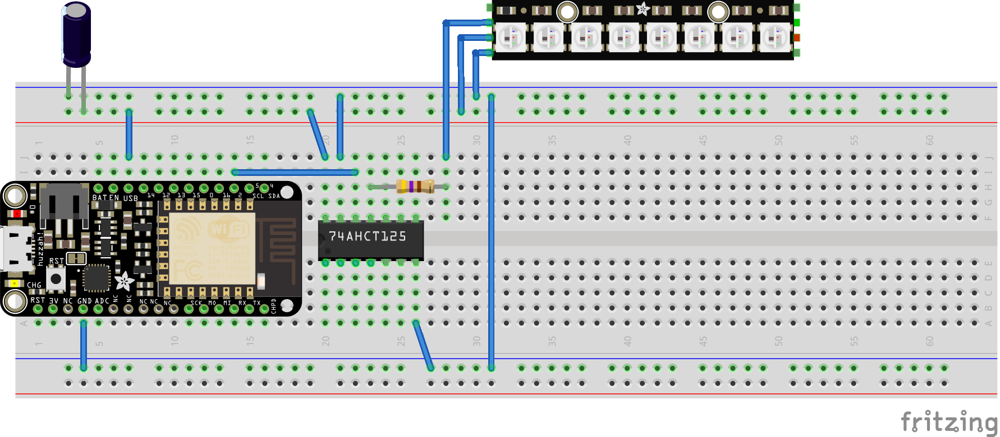

This is an [Arduino][1] sketch which implements an
[Open Pixel Control][2] server for controlling [NeoPixels][3] from an
[ESP8266][5], such as the [Adafruit Feather HUZZAH][4].

Here is an example circuit:

Bill of materials:

* [Adafruit Feather HUZZAH ESP8266][4]
* [74AHCT125 - Quad Level-Shifter][6]
* [470 ohm resistor][7]
* [Big Freaking Capacitor - 4700uF][8]
* [NeoPixel stick][9]

You will need to edit the sketch to set the number of pixels you have,
and your WiFi SSID and password.

Once the sketch is running, you'll need to figure out which IP address
it has been assigned.  Generally, your router's web interface will
have a way to look at DHCP leases, and you can find it from there.

It may also be useful to call [WiFi.hostname()][13] to assign a
hostname to your ESP board.  This may show up as `hostname.lan` in
your DNS, although it [depends on your router][14].

Once you know the IP address or hostname, you can connect with any
Open Pixel Control client.  The [openpixelcontrol repository][10] has
some [clients in Python][11], and I have [a client in Haskell][12].

## Caveats

This example is a nice proof-of-concept, but there are a couple of
reasons it isn't a robust solution.

First, interrupts are disabled while writing to NeoPixels.  Interrupts
are necessary for WiFi to work, so the server may eventually crash and
need to be rebooted, especially if you have a lot of NeoPixels.  (This
problem could be alleviated by using [DotStars][15] instead of
NeoPixels, because DotStars are not timing-sensitive and do not need
to disable interrupts.)

Second, Open Pixel Control runs over TCP, and
[TCP is not the best for real-time applications][16].  If a packet is
lost, TCP will retransmit it, delaying the packets after it.
[UDP][17] would be more suitable for this application.

[1]: https://www.arduino.cc/
[2]: http://openpixelcontrol.org/
[3]: https://www.adafruit.com/category/168
[4]: https://www.adafruit.com/products/2821
[5]: https://github.com/esp8266/Arduino
[6]: https://www.adafruit.com/products/1787
[7]: https://www.adafruit.com/products/2781
[8]: https://www.adafruit.com/products/1589
[9]: https://www.adafruit.com/products/1426
[10]: https://github.com/zestyping/openpixelcontrol/
[11]: https://github.com/zestyping/openpixelcontrol/tree/master/python
[12]: https://github.com/ppelleti/hs-opc-client
[13]: https://arduino-esp8266.readthedocs.io/en/latest/esp8266wifi/station-class.html#hostname
[14]: https://unix.stackexchange.com/questions/92441/whats-the-difference-between-local-home-and-lan
[15]: https://www.adafruit.com/category/885
[16]: https://en.wikipedia.org/wiki/Transmission_Control_Protocol#Alternatives
[17]: https://en.wikipedia.org/wiki/User_Datagram_Protocol
